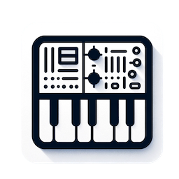

# Simple Synth

Create sounds with JavaScript. Use code to generate a waveform and hear the result in real time. 

The app will call the function `function wave(t)`, where t represents the elapsed time since the
user pressed play. 

